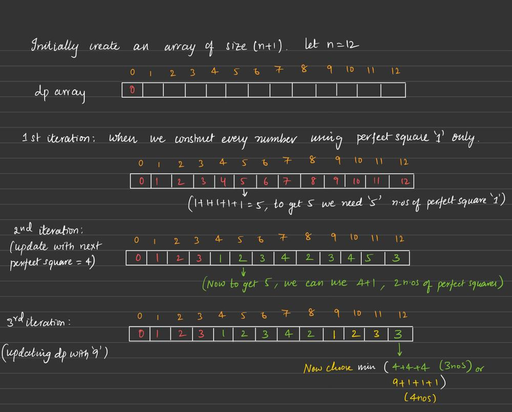
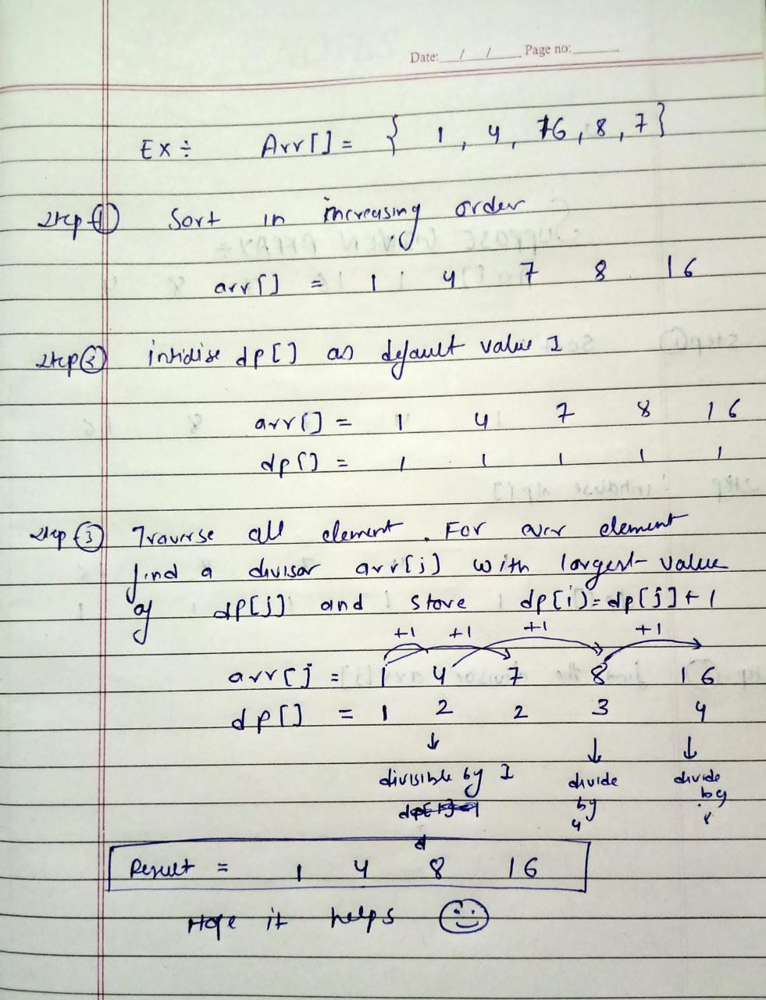

1.Reverse Integer-pop from the original number and push to the tempnumber.

 

2.Two Sum-one by one store the elements and at the same time search of complement(target-currentElement)(return {numMap[complement], i})

 

3.Merge Sorted Array-secure first n elements from nums1,put next m elements of nums2 in nums1.Sort all.

 

4.Contains Duplicate-first sort.iterate and compare consecutives

 

5.Contains Duplicate II-store in unordered_map<int,int> mp[nums[i]] = i; and then mp.count(nums[j]) to check

 

6.Binary Search-put start and end position.Select a mid position and compare with key.Choose the first part if less then else choose the second part.Keep iterating

 

7.Relative Ranks-use  priority_queue<pair<int, int>> heap; to store score and index.Iterate and asssign wordings for each.

 

8.Valid Triangle Number-sort the array and then use binary/linear search for C.A+B>=C

 

9.Russian Doll Envelopes-Both height and length should be greater.Hence customise sorting  

    static bool comp(vector<int> &envelop, vector<int> &successive_envelop){
        if(envelop[0]==successive_envelop[0]){
            return envelop[1]>successive_envelop[1];
        }
        return envelop[0]<successive_envelop[0];
    }

The first step is to sort the envelopes based on their widths in ascending order. This is done using a custom comparator function in the sort function.
    In case of a tie in widths, the envelopes are sorted in descending order of heights. This ensures that when comparing widths, if two envelopes have the same width, the one with greater height comes first.

 

10.Car Fleet-We constant the time.vector up how much timeeach car will take to reach target.Now settle them up based upon their position(Low to high).
if car at high position have time equal or more than car at low position then and only then low positioned car can chase it and can form fleet.

A two step sorting.We sorted first all cars with high position and less time.low position and less time or high position high time seems same scenario(chase case).low position and high time are last.

 

11.Number of Atoms-read character,find its one letter or more than one letter;find its digits;store all this in stack and if character ends with parenthesis than traverse in stack to update the digits for each formula element

 

12.Palindrome Number-Find the palindrom( long long reversed{0};,reversed=reversed*10 + single_digit;). || convert to string to remove unnecessary computation.
       

 

13.Reverse String-iterate till s.size()/2.swap(s[i],s[s.size()-i-1]);

 

14.Reverse Integer

 

15.First Unique Character in a String-
vector<int> all_alphabet(26);
//store frequency of each character of s
for (auto i : s) all_alphabet[i - 'a']++;

 

16.Reverse Integer

 

17.Majority Element-Sort and return the element at position n/2.

 

18.Ransom Note-store (auto i : s) magazine_alphabet[i - 'a']++; and check if ramson can be utilised.

 

19.Element Appearing More Than 25% In Sorted Array-Compare element at position i(0) and i+n/4(3) till n-n/4(12-3=9);

 

20.Roman to Integer-unordered_map<char, int> m;

        if(m[s[i]] < m[s[i+1]]){
                ans -= m[s[i]];
            }
            else{
                ans += m[s[i]];
            }

 

21.Count Primes-Sieve of Eratosthenes

    int countPrimes(int n) {
            bool prime[n + 1];
    memset(prime, true, sizeof(prime));
 
    for (int p = 2; p * p < n; p++) {
        // If prime[p] is not changed, then it is a prime
        if (prime[p] == true) {

            for (int i = p * p; i < n; i += p)
                prime[i] = false;
        }
    }
    int result{0};
     for (int p = 2; p < n; p++)
        if (prime[p])
            result++;
    
    return result;
    }

 

22.Ugly Number-Number should totally divide 2,3 and 5.if dividing than get new eg if (n % 5 == 0) n /= 5;

 

23.Add Digits-If the number divides 9,its digit sum is 9 else its digit sum is remainder.

 

24.Reverse Linked List-use current and previous.cut current->next and save it temp.put current->next to previous.update previous to current,update current to temp.

 

25.Divide Two Integers-consider
// a = 5(00000101), b = 9(00001001)
    unsigned char a = 5, b = 9;

    // The result is 00001010
    cout << "a<<1 = " << (a << 1) << endl;

    // The result is 00010010
    cout << "b<<1 = " << (b << 1) << endl;
We first see if divisor==divident,than we check for sign ,than we make both of them positive,than we perform divison using shift operator.
    while (n >= d) {
            int count = 0;
            while (n > (d << (count + 1)))
                count++;
            n -= d << count;
            ans += 1 << count;
        }

        // Handle overflow case
        if (ans == (1 << 31) && sign == 1) return INT_MAX;

 

26.Single Number-XOR of same numbers is 1.

 

27.Rotate String-Check whether string A+A contains string B.

 

28.Valid Parentheses-push the parenthesis if the stack is empty or any open parenthesis,if s[i] is closed parenthesis drop the stack top element if its same type open parenthesis.

 

29.Power of Two-if n%2==0 than recursive call for n/2 till n becomes less than 2.

 

30.Power of Three-if n%3==0 than recursive call for n/3 till n becomes less than 3.

 

31.Power of Four-if n%4==0 than recursive call for n/4 till n becomes less than 4.

 

32.Excel Sheet Column Number-Consider ABCD->
res=res*26 +1;

res=1*26 +2;

res=28*26+3;

res=(28*26+3)*26 +4;

 

33.Sqrt(x)-using binary search to check where the sqroot of numbers lies.

 

34.Determine if String Halves Are Alike-store count of vowels in two variables and compare after the traversal.

 

35.Pow(x, n)

    double pow(double a, int b) {

    //base case
    if( b == 0 )
        return 1;

    if(b == 1)
        return a;

    //RECURSIVE CALL
    int ans = pow(a, b/2);

    //if b is even
    if(b%2 == 0) {
        return ans * ans;
    }
    else {
        //if b is odd
        return a * ans * ans;
    }
    }

 

36.Remove Digit From Number to Maximize Result-Search the digit in number.Store temp for number.temp.erase(temp.begin() + i); and store max of result.
**If string is large,the number is large.**

 

37.Smallest Even Multiple-if number doesn't divides 2 than answer is twice of number,else the number.

 

38.Remove All Adjacent Duplicates In string-Use stack and when top element is same as new element remove both of them.

 

39.Number of Common Factors-max common number will be minimum of two.Hence we iterate from 1 to min(a,b) and divide to check the factors.

 

40. Find the Maximum Achievable Number-Increse num by 2*t +1

 

41. Number of Good Pairs-double loop to iterate ,check and add to result

 

42.Convert the Temperature-

 

43.Count the Digits That Divide a Number

 

44.Add Two Integers

 

45.Determine Color of a Chessboard Square-both odd and both even makes black

 

46.Count Sorted Vowel Strings-Pure mathematics
https://leetcode.com/problems/count-sorted-vowel-strings/solutions/5675413/dp-detailed-explanation/

 

47.Total Distance Traveled-maths

 

48.Categorize Box According to Criteria-condition loops

 

49.Find the Difference-just loop thing

 

50.Find the Index of the First Occurrence in a String-check with first letter of the needle,if it matches check with the other letters with some internal loop.

 

-------------------------Half Centuary---------------------------

51.Valid Anagram-use unordered_map<char, int> count; for any frequency check problems

 

52.Move Zeroes-Put the numbers in the same array and skip zeros.On traversing add zeros based upon the size .

 

53.Reverse Words in a String-store words in a cector.Traverse half and swap.
        ss<<s;
        while (ss >> words)
        {
            vstring.push_back(words);
        }

 

54.Find the Highest Altitude-compare the difference between the two consecutive values with the max altitude achived so far

 

55.Product of Array Except Self-
;

        class Solution {
        public:
            vector<int> productExceptSelf(vector<int>& nums) {
                vector<int> output(nums.size(), 1);

                int left = 1;
                for (int i = 0; i < nums.size(); i++) {
                    output[i] *= left;
                    left *= nums[i];
                }

                int right = 1;
                for (int i = nums.size() - 1; i >= 0; i--) {
                    output[i] *= right;
                    right *= nums[i];
                }

                return output;        
            }
        };

 

56.Implement Queue using Stacks-make two stack.One for input and one for output.Take into 'input' and on popping do it in 'output'.

 

57.Is Subsequence-an iterative approach could be better.in the end result can be compared with the length of the short string

 

58.Number of Recent Calls-simple class implementation

 

59.Merge Sorted Array-double loop and store in num3.

 

60.Daily Temperatures-put all the temperature indexes in stack.If the new value is more than the current top,then add to the days_result=i-st.top().{Whenever we need to hold at particular index and traverse the array ,use stack}

 

61.Next Greater Element I-We want to sort num2 and also should get direct info about if num1[i] is present or not.Sort using stack and hold in undered_map.

 

62.Divide Array Into Arrays With Max Difference-sort the vector.Push into the result vector with check of 1st and 3rd(bcz 2nd will qualify already in that case)

 

63.Number of Students Unable to Eat Lunch-get from vector to the q and stack.Match stack top with q front and drop if matches(also make lastserved=0) and push to q if don't and increment a variable(lastserved) to keep track  and compare that with the q size to leave the loop.Return q size. 

 

64.Best Time to Buy and Sell Stock-Iterate and update the min value.Hold the max_profit.
;

            res = max(res, prices[i] - minValue);
            minValue = min(minValue, prices[i]);

 

65.Sequential Digits-start from single digit and keep adding +1 of tenth.If the number lies between low and high,add it to our result.Iterate from 10 to number length to 10^9.Break if number goes higher than high.

66.Minimum Size Subarray Sum-Variable size Sliding window.if the increase right till we get sum eq/gr to target and there after increase left till condition satisfies.

 

67. Minimum Window Substring-Use two pointers: start and end to represent a window.Move end to find a valid window.When a valid window is found, move start to find a smaller window in the same valid window.

 

68.Running Sum of 1d Array

 

69.Remove Element-compare and update value in the same array by using extra variable j.

 

70.First Unique Character in a String-unordered_map

 

71.Partition Array for Maximum Sum-Iterate through the whole array,use k to find max(save_max and index) of subarray taking array index 0(fir the first time),overwrite the value in og array.
next interation of index check with save_max and index difference of k(to get new sav_max and index),overwrite and repeat
Store sum in dp for each index

 

72.Group Anagrams-in sort the word and store in unordered_map with its index.

 

73.Design Parking System

 

74.Remove Duplicates from Sorted Array-use variable j and overwrite if current not equal to previous.

 

75.Sort Characters By Frequency-
;
class Solution {
public:
    string frequencySort(string s) {
        unordered_map<char,int> freq;
        vector<string> bucket(s.size()+1, "");
        string res;
        
        //count frequency of each character
        for(char c:s) freq[c]++;
        //put character into frequency bucket
        for(auto& it:freq) {
            int n = it.second;
            char c = it.first;
            bucket[n].append(n, c);
        }
        //form descending sorted string
        for(int i=s.size(); i>0; i--) {
            if(!bucket[i].empty())
                res.append(bucket[i]);
        }
        return res;
    }
};
 

76.Perfect Squares-

 

77.Maximum Sum With Exactly K Elements-find the max value,add it to score k times with +1(k-1) times

 

78.Minimum Operations to Make the Array Increasing-iterate through,if dec value found +1 and store count,Keep doing untill finish

 

79.Largest Divisible Subset-sort,traverse all index array and store their divisors

 

80.Palindromic Substrings-find all substring,check for palindrome.
class Solution {
public:
    int countSubstrings(string s) {
        int n = s.length(), ans = 0;
        for (int i = 0; i < n; ++i) {
            int even = palindromeCount(s, i, i + 1);
            int odd = palindromeCount(s, i, i);
            ans += even + odd;
        }
        return ans;
    }

    int palindromeCount(const string& s, int left, int right) {
        int count = 0;
        while (left >= 0 && right < s.length() && s[left] == s[right]) {
            --left;
            ++right;
            ++count;
        }
        return count;
    }
};

 

